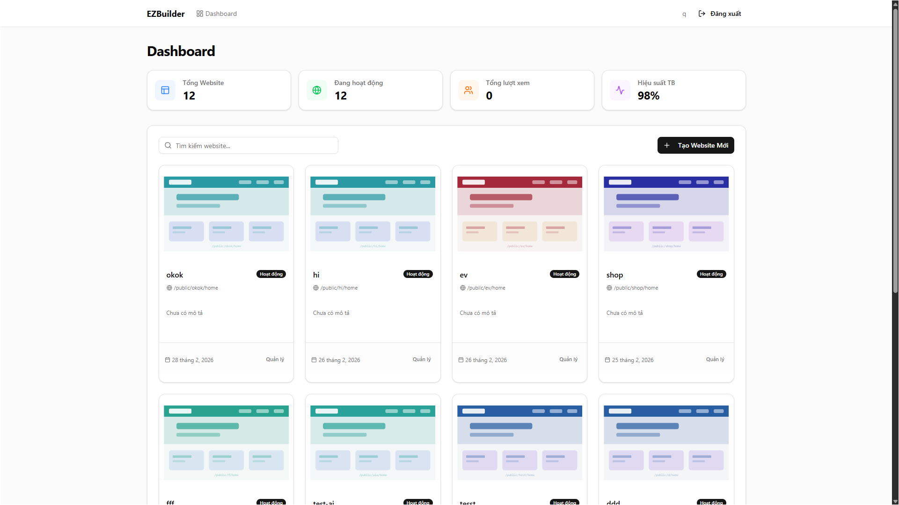
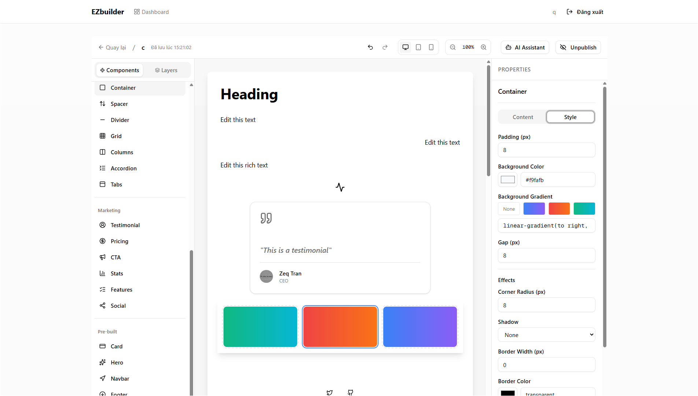
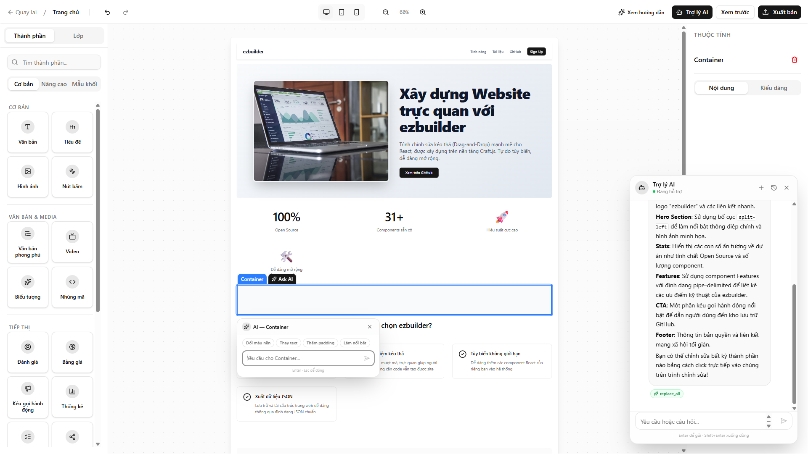
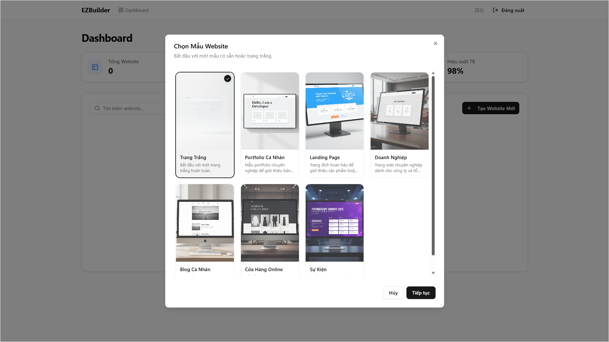

# EZBuilder

> An advanced AI-powered website builder platform designed specifically for non-technical users, featuring intuitive drag-and-drop mechanics and contextual generative AI.


## Preview & Screenshots

<table width="100%">
  <tr>
    <td width="50%" valign="top">
      <h3>Dashboard & Project Management</h3>
      <p>Manage your website projects, view comprehensive statistics, and organize your work seamlessly.</p>
      
    </td>
    <td width="50%" valign="top">
      <h3>Drag-and-Drop Builder Interface</h3>
      <p>An intuitive, real-time feedback editor for high customizability and pixel-perfect design.</p>
      
    </td>
  </tr>
  <tr>
    <td width="50%" valign="top">
      <h3>AI Design Assistant</h3>
      <p>Generate, iterate, and refine UI components using natural language via the integrated AI Assistant.</p>
      
    </td>
    <td width="50%" valign="top">
      <h3>Starter Templates</h3>
      <p>Choose from a variety of professional templates to kickstart your website.</p>
      
    </td>
  </tr>
</table>

## Features

- **No-Code Friendly UI**: Localized interface with auto-save indicators, safe-delete confirmations, and an intelligent onboarding tour to eliminate the learning curve.
- **Smart Visual Editor**: Powered by Craft.js, featuring a visual toolbox, pre-built structural blocks, and intuitive tuning sliders for spacing and layout.
- **Context-Aware AI Assistant**: Integrated AI that suggests the next best steps based on your current page structure and content.
- **Inline AI Chat**: Click on any specific element to instantly rewrite text, change colors, or redesign sections via quick natural language prompts.
- **Global Style Editor**: Seamlessly switch brand colors, web typography (Google Fonts), and UI scales across the entire project.
- **1-Click Publishing**: Automated subdomain generation and a smooth publishing wizard for instant website deployment.
- **Project Dashboard**: A fully-featured dashboard with search, filtering, and responsive grid layouts to manage websites.

## Tech Stack

### Frontend (`/web`)

- **Core**: Next.js (React 19)
- **Styling**: Tailwind CSS v4, shadcn/ui, Framer Motion
- **Editor**: Craft.js
- **State**: Zustand

### Backend (`/api`)

- **Core**: NestJS (Node.js 22)
- **Database**: PostgreSQL with Prisma ORM
- **AI**: Vercel AI SDK & Google Generative AI
- **Security & Auth**: Passport.js (JWT & Google OAuth2.0)

## Quick Start

### Prerequisites

- Node.js (v20+ recommended)
- PostgreSQL Server
- Google Gemini API Key
- Google OAuth Client Credentials (for Auth)

### 1. Setup Backend (`/api`)

```bash
cd api
npm install

# Setup your environment variables
cp .env.example .env

# Run database migrations
npx prisma generate
npx prisma db push # or npx prisma migrate dev

# Start the development server
npm run start:dev
```

### 2. Setup Frontend (`/web`)

```bash
cd web
npm install

# Setup your environment variables
cp .env.example .env

# Start the development server
npm run dev
```

## License

This project is licensed under the [Apache License 2.0](LICENSE).  
Copyright © 2026 **Tran Dinh Quy**.
