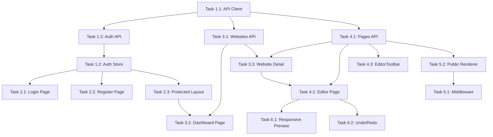

# Web Frontend Implementation Plan

## Overview

**Problem:** API backend đã triển khai đầy đủ các endpoints (Auth, Websites, Pages, Public), nhưng web frontend chưa có:

- API client để kết nối với backend
- Auth context/state management
- Dashboard UI để quản lý websites
- Editor integration với backend (save/load)
- Subdomain routing cho public pages

**Goal:** Triển khai đầy đủ các features frontend để hoàn thành luồng MVP từ Register → Create Website → Edit Pages → Publish.

---

## Current State Analysis

### ✅ Đã Triển Khai (API)

| Module   | Endpoints                                                                           | Status  |
| -------- | ----------------------------------------------------------------------------------- | ------- |
| Auth     | `POST /auth/register`, `POST /auth/login`                                           | ✅ Done |
| Websites | `GET/POST/PATCH/DELETE /websites`, `GET /websites/:id`                              | ✅ Done |
| Pages    | `GET/POST/PATCH /pages/:id`, `POST /pages/:id/publish`, `POST /pages/:id/unpublish` | ✅ Done |
| Public   | `GET /public/:subdomain/:slug`                                                      | ✅ Done |

### ✅ Đã Triển Khai (Web)

| Component            | Location                        | Status  |
| -------------------- | ------------------------------- | ------- |
| 12 Editor Components | `components/editor/components/` | ✅ Done |
| Builder.tsx          | `components/editor/`            | ✅ Done |
| SettingsPanel.tsx    | `components/editor/`            | ✅ Done |
| Toolbox.tsx          | `components/editor/`            | ✅ Done |
| EditorToolbar.tsx    | `components/editor/`            | ✅ Done |
| PublicRenderer.tsx   | `components/editor/`            | ✅ Done |
| Homepage             | `app/page.tsx`                  | ✅ Done |
| shadcn/ui            | `components/ui/`                | ✅ Done |

### ❌ Chưa Triển Khai (Web)

| Feature                          | Priority |
| -------------------------------- | -------- |
| API Client (fetch wrapper)       | P0       |
| Auth Context + JWT Storage       | P0       |
| Login/Register Pages             | P0       |
| Dashboard Page (list websites)   | P0       |
| Website Detail Page (list pages) | P0       |
| Editor Integration (save/load)   | P0       |
| Public Page Rendering            | P1       |
| Subdomain Middleware             | P1       |
| Responsive Preview               | P2       |
| Undo/Redo                        | P2       |

---

## Tech Stack

| Technology      | Purpose          | Rationale                            |
| --------------- | ---------------- | ------------------------------------ |
| **Next.js 16**  | App Router       | Already in use                       |
| **Craft.js**    | Visual Editor    | Already in use                       |
| **Zustand**     | State Management | Already installed, simple auth state |
| **shadcn/ui**   | UI Components    | Already in use                       |
| **Tailwind v4** | Styling          | Already in use                       |

---

## File Structure (Proposed Changes)

```
web/
├── app/
│   ├── (auth)/                    # [NEW] Auth layout group
│   │   ├── login/
│   │   │   └── page.tsx           # [NEW] Login page
│   │   ├── register/
│   │   │   └── page.tsx           # [NEW] Register page
│   │   └── layout.tsx             # [NEW] Auth layout
│   ├── (dashboard)/
│   │   ├── dashboard/
│   │   │   └── page.tsx           # [MODIFY] List websites
│   │   ├── editor/
│   │   │   └── [pageId]/
│   │   │       └── page.tsx       # [MODIFY] Editor with save/load
│   │   ├── sites/
│   │   │   └── [websiteId]/
│   │   │       └── page.tsx       # [NEW] Website detail (list pages)
│   │   └── layout.tsx             # [MODIFY] Protected layout with sidebar
│   ├── [subdomain]/               # [NEW] Public pages
│   │   └── [[...slug]]/
│   │       └── page.tsx           # [NEW] Public page renderer
│   └── middleware.ts              # [NEW] Subdomain routing
├── components/
│   ├── auth/                      # [NEW] Auth components
│   │   ├── LoginForm.tsx
│   │   └── RegisterForm.tsx
│   ├── dashboard/                 # [NEW] Dashboard components
│   │   ├── WebsiteCard.tsx
│   │   ├── PageCard.tsx
│   │   ├── CreateWebsiteDialog.tsx
│   │   └── CreatePageDialog.tsx
│   └── layout/                    # [NEW] Layout components
│       ├── DashboardHeader.tsx
│       └── DashboardSidebar.tsx
└── lib/
    ├── api/                       # [NEW] API client
    │   ├── client.ts              # Fetch wrapper with auth
    │   ├── auth.ts                # Auth API
    │   ├── websites.ts            # Websites API
    │   └── pages.ts               # Pages API
    └── stores/                    # [NEW] Zustand stores
        └── auth-store.ts          # Auth state
```

---

## Task Breakdown

### Phase 1: Foundation (API Client & Auth)

#### Task 1.1: Create API Client

- **Agent:** `frontend-specialist`
- **Files:** `lib/api/client.ts`
- **INPUT:** API base URL (http://localhost:3001/api/v1)
- **OUTPUT:** Fetch wrapper with JWT header injection, error handling
- **VERIFY:** Unit test with mock fetch

#### Task 1.2: Create Auth Store (Zustand)

- **Agent:** `frontend-specialist`
- **Files:** `lib/stores/auth-store.ts`
- **INPUT:** Zustand setup
- **OUTPUT:** Store with user, token, login, logout, isAuthenticated
- **VERIFY:** Store functions work correctly

#### Task 1.3: Create Auth API Functions

- **Agent:** `frontend-specialist`
- **Files:** `lib/api/auth.ts`
- **INPUT:** API client
- **OUTPUT:** `register()`, `login()`, `getMe()` functions
- **VERIFY:** Type-safe responses

---

### Phase 2: Auth UI

#### Task 2.1: Create Login Page

- **Agent:** `frontend-specialist`
- **Files:** `app/(auth)/login/page.tsx`, `components/auth/LoginForm.tsx`
- **INPUT:** Auth API, Auth Store
- **OUTPUT:** Login form with email/password, redirect to dashboard
- **VERIFY:** Manual test: login flow

#### Task 2.2: Create Register Page

- **Agent:** `frontend-specialist`
- **Files:** `app/(auth)/register/page.tsx`, `components/auth/RegisterForm.tsx`
- **INPUT:** Auth API, Auth Store
- **OUTPUT:** Register form, auto-login after register
- **VERIFY:** Manual test: register flow

#### Task 2.3: Protected Route Layout

- **Agent:** `frontend-specialist`
- **Files:** `app/(dashboard)/layout.tsx`
- **INPUT:** Auth Store
- **OUTPUT:** Redirect to login if not authenticated
- **VERIFY:** Manual test: access dashboard without login

---

### Phase 3: Dashboard UI

#### Task 3.1: Create Websites API Functions

- **Agent:** `frontend-specialist`
- **Files:** `lib/api/websites.ts`
- **INPUT:** API client
- **OUTPUT:** `getWebsites()`, `createWebsite()`, `deleteWebsite()` functions
- **VERIFY:** Type-safe responses

#### Task 3.2: Dashboard Page (List Websites)

- **Agent:** `frontend-specialist`
- **Files:** `app/(dashboard)/dashboard/page.tsx`, `components/dashboard/WebsiteCard.tsx`, `components/dashboard/CreateWebsiteDialog.tsx`
- **INPUT:** Websites API
- **OUTPUT:** Grid of website cards, create new button
- **VERIFY:** Manual test: view and create websites

#### Task 3.3: Website Detail Page (List Pages)

- **Agent:** `frontend-specialist`
- **Files:** `app/(dashboard)/sites/[websiteId]/page.tsx`, `components/dashboard/PageCard.tsx`, `components/dashboard/CreatePageDialog.tsx`
- **INPUT:** Websites API, Pages API
- **OUTPUT:** List pages of website, create new page button
- **VERIFY:** Manual test: view and create pages

---

### Phase 4: Editor Integration

#### Task 4.1: Create Pages API Functions

- **Agent:** `frontend-specialist`
- **Files:** `lib/api/pages.ts`
- **INPUT:** API client
- **OUTPUT:** `getPage()`, `updatePage()`, `publishPage()`, `unpublishPage()` functions
- **VERIFY:** Type-safe responses

#### Task 4.2: Editor Page with Save/Load

- **Agent:** `frontend-specialist`
- **Files:** `app/(dashboard)/editor/[pageId]/page.tsx`
- **INPUT:** Pages API, Builder component
- **OUTPUT:** Load page content on mount, auto-save on change, publish button
- **VERIFY:** Manual test: edit and save page

#### Task 4.3: Update EditorToolbar

- **Agent:** `frontend-specialist`
- **Files:** `components/editor/EditorToolbar.tsx`
- **INPUT:** Pages API
- **OUTPUT:** Save status indicator, Publish/Unpublish buttons
- **VERIFY:** Manual test: publish flow

---

### Phase 5: Public Pages

#### Task 5.1: Subdomain Middleware

- **Agent:** `frontend-specialist`
- **Files:** `middleware.ts`
- **INPUT:** Request hostname
- **OUTPUT:** Rewrite to `[subdomain]` route
- **VERIFY:** Manual test with hosts file

#### Task 5.2: Public Page Renderer

- **Agent:** `frontend-specialist`
- **Files:** `app/[subdomain]/[[...slug]]/page.tsx`
- **INPUT:** Public API
- **OUTPUT:** Render page content with PublicRenderer
- **VERIFY:** Manual test: view published page

---

### Phase 6: Polish (P2)

#### Task 6.1: Responsive Preview

- **Agent:** `frontend-specialist`
- **Files:** `components/editor/EditorToolbar.tsx`, `components/editor/Canvas.tsx`
- **INPUT:** None
- **OUTPUT:** Toggle between desktop/tablet/mobile preview
- **VERIFY:** Manual test

#### Task 6.2: Undo/Redo

- **Agent:** `frontend-specialist`
- **Files:** `components/editor/Builder.tsx`
- **INPUT:** Craft.js history API
- **OUTPUT:** Ctrl+Z, Ctrl+Y support, undo/redo buttons
- **VERIFY:** Manual test

---

## User Review Required

> [!IMPORTANT]
> **API Base URL:** Hiện tại plan sử dụng `http://localhost:3001/api/v1`. Nếu cần thay đổi, vui lòng cho biết.

> [!WARNING]  
> **Multi-tenancy:** Để test subdomain routing trên localhost, cần thêm entries vào file `hosts`:
>
> ```
> 127.0.0.1 test-site.localhost
> 127.0.0.1 my-portfolio.localhost
> ```
>
> Điều này chỉ cần cho development.

---

## Verification Plan

### Automated Tests (Proposed)

Hiện tại web chưa có test framework. Đề xuất:

1. **Add Jest + React Testing Library:**

   ```bash
   cd web
   npm install -D jest @testing-library/react @testing-library/jest-dom jest-environment-jsdom
   ```

2. **Test files to add:**
   - `lib/api/__tests__/client.test.ts` - Test API client
   - `lib/stores/__tests__/auth-store.test.ts` - Test auth store

### Manual Verification (Primary)

| Step | Test Case                            | Expected Result                              |
| ---- | ------------------------------------ | -------------------------------------------- |
| 1    | Visit `/register`, fill form, submit | Redirect to `/dashboard`, user logged in     |
| 2    | Visit `/login`, fill form, submit    | Redirect to `/dashboard`, user logged in     |
| 3    | On dashboard, click "Create Website" | Dialog opens, fill form, new website appears |
| 4    | Click website card                   | Navigate to website detail with pages list   |
| 5    | Click "Create Page"                  | Dialog opens, fill form, new page appears    |
| 6    | Click page card                      | Navigate to editor, page content loads       |
| 7    | Drag component to canvas, wait 2s    | Auto-save triggers, no error                 |
| 8    | Click "Publish" button               | Page status changes to Published             |
| 9    | Visit `{subdomain}.localhost:3000`   | Public page renders correctly                |
| 10   | Logout and visit `/dashboard`        | Redirect to `/login`                         |

### Build Verification

```bash
cd web
npm run build  # Must pass without errors
npm run lint   # Must pass without errors
```

---

## Dependency Graph



---

## Timeline Estimate

| Phase               | Tasks         | Estimated Time  |
| ------------------- | ------------- | --------------- |
| Phase 1: Foundation | 1.1, 1.2, 1.3 | 2-3 hours       |
| Phase 2: Auth UI    | 2.1, 2.2, 2.3 | 2-3 hours       |
| Phase 3: Dashboard  | 3.1, 3.2, 3.3 | 3-4 hours       |
| Phase 4: Editor     | 4.1, 4.2, 4.3 | 3-4 hours       |
| Phase 5: Public     | 5.1, 5.2      | 2-3 hours       |
| Phase 6: Polish     | 6.1, 6.2      | 2-3 hours       |
| **Total**           | 15 tasks      | **14-20 hours** |

---

## Phase X: Final Verification

- [ ] All pages accessible without console errors
- [ ] All API calls return expected responses
- [ ] Auth flow works correctly
- [ ] Editor saves and loads content
- [ ] Publish/unpublish works
- [ ] `npm run build` passes
- [ ] `npm run lint` passes
